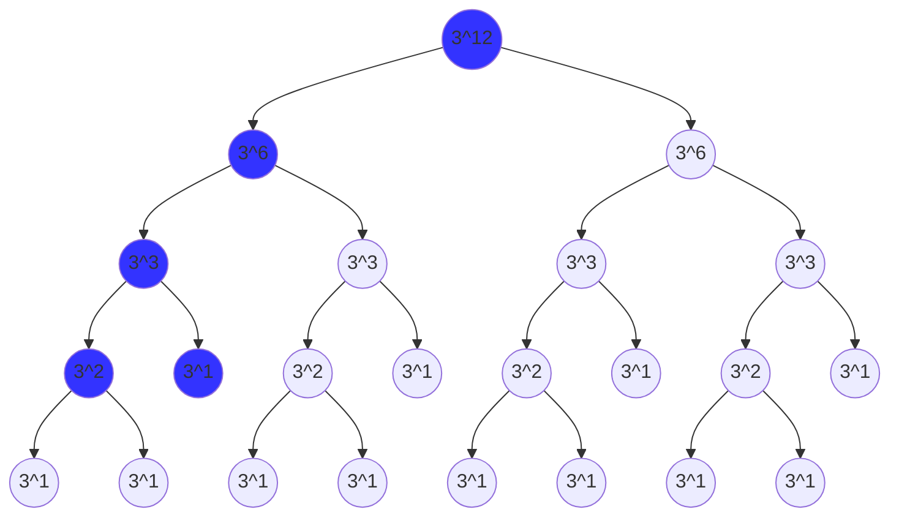

# 2分木

## 3^12

- 青丸は初回計算のため、キャッシュされる
- 黒丸はキャッシュから答えを取得する

```mermaid

flowchart TB

   classDef cache fill:#33f

   3-12(("3^12")) --> 3-6a(("3^6")) & 3-6b(("3^6"))

   3-6a(("3^6")) --> 3-3a(("3^3")) & 3-3b(("3^3"))
   3-6b(("3^6")) --> 3-3c(("3^3")) & 3-3d(("3^3"))

   3-3a(("3^3")) --> 3-2a(("3^2")) & 3-1a(("3^1"))
   3-3b(("3^3")) --> 3-2b(("3^2")) & 3-1b(("3^1"))
   3-3c(("3^3")) --> 3-2c(("3^2")) & 3-1c(("3^1"))
   3-3d(("3^3")) --> 3-2d(("3^2")) & 3-1d(("3^1"))

   3-2a(("3^2")) --> 3-1aa(("3^1")) & 3-1aaa(("3^1"))
   3-2b(("3^2")) --> 3-1bb(("3^1")) & 3-1bbb(("3^1"))
   3-2c(("3^2")) --> 3-1cc(("3^1")) & 3-1ccc(("3^1"))
   3-2d(("3^2")) --> 3-1dd(("3^1")) & 3-1ddd(("3^1"))

   3-12:::cache
   3-6a:::cache
   3-3a:::cache
   3-2a:::cache
   3-1a:::cache

```